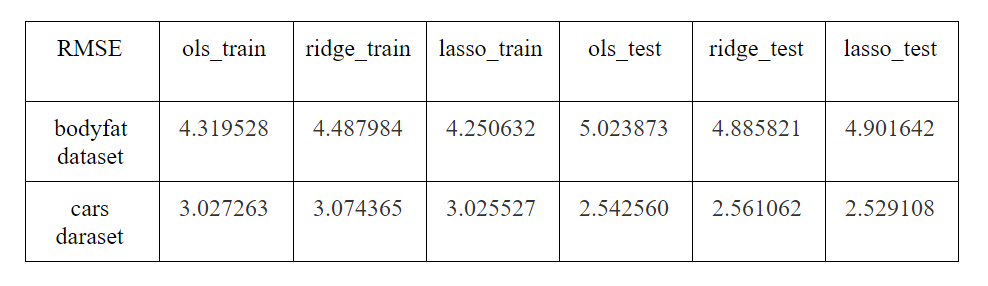

# A Real Example

```{r, echo=FALSE,warning=FALSE,message=FALSE,include=FALSE}
library(ggplot2)
library(readr)
library(dplyr)
library(rsample) #for splitting data
library(caret)
library(ISLR)
library(glmnet)
library(coefplot)
```

### Cross validation

> Cross validation randomly divides the data set into k folds, k-1 training groups to which models will be fitted and one testing group to test the model.


(from Hands-On Machine Learning with R 2.4 by Bradley Boehmke & Brandon Greenwell)

```{r, echo=FALSE,warning=FALSE,message=FALSE,include=FALSE}
# Load the data
# Highly correlated
# Numerical
bf<-read.csv("Bodyfat.csv")

set.seed(455)
bf_split <- initial_split(bf%>%select(-Density), prop = .7)
bf_train <- training(bf_split)
bf_test <- testing(bf_split)
```

### OLS

```{r}
set.seed(455)
bf_ols <- train(
  bodyfat ~ .,
  data = bf_train, 
  method = "lm",
  trControl = trainControl(method = "cv", 
                           number = 10), 
  na.action = na.omit
)

coefficients(bf_ols$finalModel)
```

### RIDGE

```{r}
set.seed(455)
bf_ridge <- train(
  bodyfat ~ .,
  data = bf_train, 
  method = "glmnet",
  trControl = trainControl(method = "cv", 
                           number = 10),
  tuneGrid = data.frame(alpha = 0, 
                        lambda = 10^seq(-3,0, length = 100)),
  na.action = na.omit
)

bf_ridge%>%
  ggplot(aes(x=lambda,y=RMSE))+
  geom_point(size = .5, alpha = .5)

bf_ridge$bestTune$lambda

plot(bf_ridge$finalModel,xvar="lambda",label=TRUE)
```

```{r}
set.seed(455)
bf_ridge_best <- train(
  bodyfat ~ .,
  data = bf_train, 
  method = "glmnet",
  trControl = trainControl(method = "cv", 
                           number = 10),
  tuneGrid = data.frame(alpha = 0, 
                        lambda = 0.6135907),
  na.action = na.omit
)

coefficients(bf_ridge_best$finalModel)
```

### LASSO

```{r}
set.seed(455)
bf_lasso <- train(
  bodyfat ~ .,
  data = bf_train, 
  method = "glmnet",
  trControl = trainControl(method = "cv", 
                           number = 10),
  tuneGrid = data.frame(alpha = 1, 
                        lambda = 10^seq(-3, -1, length = 100)),
  na.action = na.omit
)

bf_lasso%>%
  ggplot(aes(x=lambda,y=RMSE))+
  geom_point(size = .5, alpha = .5)

bf_lasso$bestTune$lambda

plot(bf_lasso$finalModel,xvar='lambda',label=TRUE)
```

```{r}
set.seed(455)
bf_lasso_best <- train(
  bodyfat ~ .,
  data = bf_train, 
  method = "glmnet",
  trControl = trainControl(method = "cv", 
                           number = 10),
  tuneGrid = data.frame(alpha = 1, 
                        lambda = 0.05214008),
  na.action = na.omit
)

coefficients(bf_lasso_best$finalModel)
```

### Test data

```{r}
bf_test%>%
  mutate(pred_bf = predict(bf_ols, newdata = bf_test)) %>% 
  summarize(RMSE = sqrt(mean((bodyfat - pred_bf)^2)))

bf_test%>%
  mutate(pred_bf = predict(bf_ridge_best, newdata = bf_test)) %>% 
  summarize(RMSE = sqrt(mean((bodyfat - pred_bf)^2)))

bf_test%>%
  mutate(pred_bf = predict(bf_lasso_best, newdata = bf_test)) %>% 
  summarize(RMSE = sqrt(mean((bodyfat - pred_bf)^2)))
```

### Activity

```{r,echo=FALSE,warning=FALSE,message=FALSE,include=FALSE}
# Load the data
# Not highly correlated
# Numerical+categorial
cars2018 <- read_csv("cars2018.csv", col_types = cols(Model = col_skip(), 
    `Model Index` = col_skip()))
```

```{r}
set.seed(455)
cars_split <- initial_split(cars2018, prop = .7)
cars_train <- training(cars_split)
cars_test <- testing(cars_split)
```

### OLS

```{r}
set.seed(455)
cars_ols <- train(
  MPG ~ .,
  data = cars_train, 
  method = "lm",
  trControl = trainControl(method = "cv", 
                           number = 10), 
  na.action = na.omit
)

coefficients(cars_ols$finalModel)

cars_ols$results$RMSE
```

### RIDGE

```{r}
set.seed(455)
cars_ridge <- train(
  MPG ~ .,
  data = cars_train, 
  method = "glmnet",
  trControl = trainControl(method = "cv", 
                           number = 10),
  tuneGrid = data.frame(alpha = 0, 
                        lambda = 10^seq(-3,0, length = 100)),
  na.action = na.omit
)

cars_ridge%>%
  ggplot(aes(x=lambda,y=RMSE))+
  geom_point(size = .5, alpha = .5)

cars_ridge$bestTune$lambda

plot(cars_ridge$finalModel,xvar="lambda",label=TRUE)
```

```{r}
set.seed(455)
cars_ridge_best <- train(
  MPG ~ .,
  data = cars_train, 
  method = "glmnet",
  trControl = trainControl(method = "cv", 
                           number = 10),
  tuneGrid = data.frame(alpha = 0, 
                        lambda = 0.3764936),
  na.action = na.omit
)

cars_ridge_best$results$RMSE

coefficients(cars_ridge_best$finalModel)
```

### LASSO

```{r}
set.seed(455)
cars_lasso <- train(
  MPG ~ .,
  data = cars_train, 
  method = "glmnet",
  trControl = trainControl(method = "cv", 
                           number = 10),
  tuneGrid = data.frame(alpha = 1, 
                        lambda = 10^seq(-3, -2, length = 100)),
  na.action = na.omit
)

cars_lasso%>%
  ggplot(aes(x=lambda,y=RMSE))+
  geom_point(size = .5, alpha = .5)

cars_lasso$bestTune$lambda

plot(cars_lasso$finalModel,xvar='lambda',label=TRUE)
```

```{r}
set.seed(455)
cars_lasso_best <- train(
  MPG ~ .,
  data = cars_train, 
  method = "glmnet",
  trControl = trainControl(method = "cv", 
                           number = 10),
  tuneGrid = data.frame(alpha = 1, 
                        lambda = 0.009545485),
  na.action = na.omit
)

cars_lasso_best$results$RMSE

coefficients(cars_lasso_best$finalModel)
```

### Test data

```{r}
cars_test%>%
  mutate(pred_mpg = predict(cars_ols, newdata = cars_test)) %>% 
  summarize(RMSE = sqrt(mean((MPG - pred_mpg)^2)))

cars_test%>%
  mutate(pred_mpg = predict(cars_ridge_best, newdata = cars_test)) %>% 
  summarize(RMSE = sqrt(mean((MPG - pred_mpg)^2)))

cars_test%>%
  mutate(pred_mpg = predict(cars_lasso_best, newdata = cars_test)) %>% 
  summarize(RMSE = sqrt(mean((MPG - pred_mpg)^2)))
```

## Data Summary



> From the summary table above, we can see that for the highly corrlated numerical dataset bodyfat, lasso gives the smallest training RMSE while ridge gives the smallest testing RMSE. For the less correlated dataset cars with categorical variables included, lasso always gives the smallest RMSE.